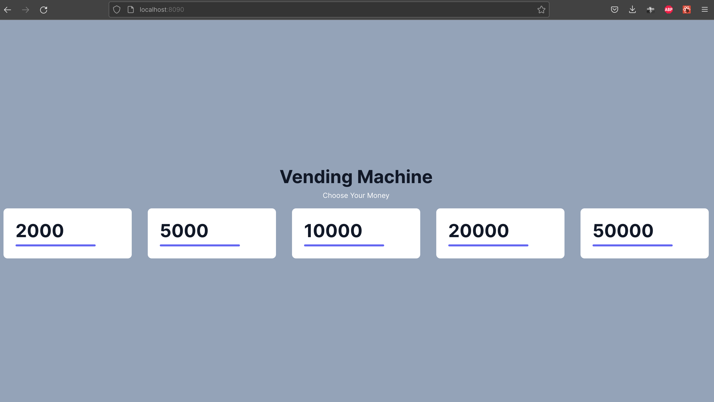
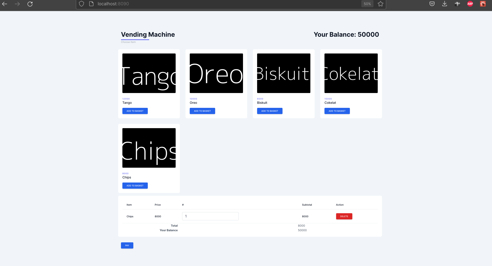

# Spring Boot - ReactJS Vending Machine

### Specification
* Java Version 11
* Node version 16++
* spring boot
* swagger
* db H2

### Step
1. copy `application.properties.example` to `application.properties`
2. run `npm install`
2. run `npm run react`
3. open new terminal & run `./mvnw clean spring-boot:run`
4. config file in application.properties

### Preview

